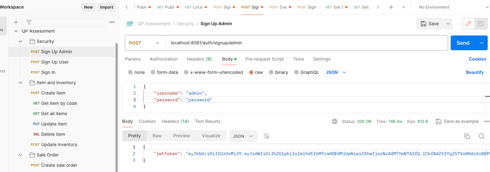
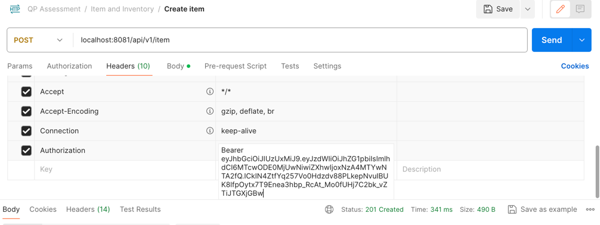
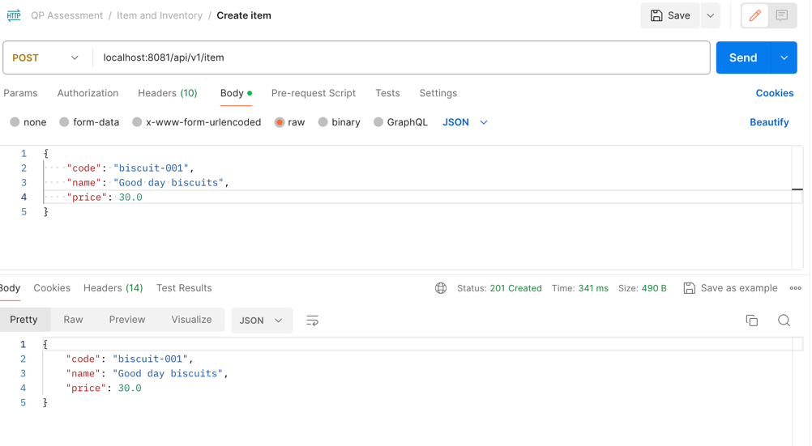
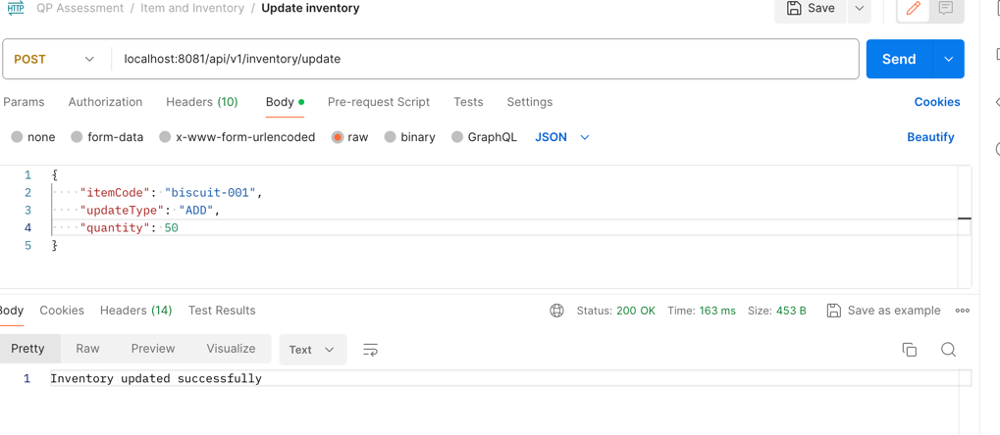
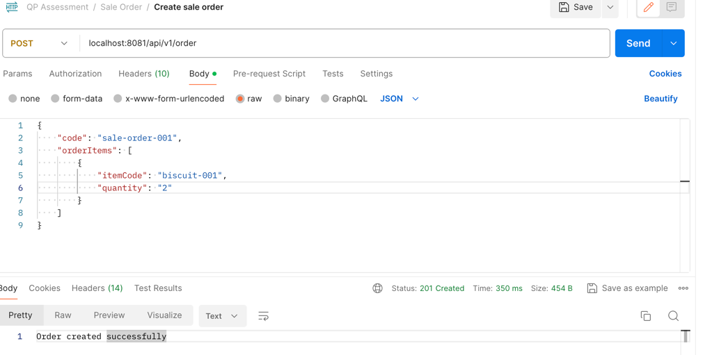
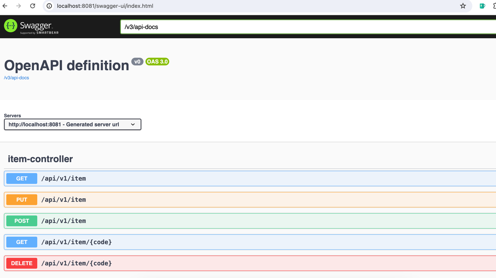

# Grocery Booking Application
The application enables users to create and manage grocery items while also facilitating the creation of sale orders.

## Feature Overview
The app supports two roles: ADMIN and USER

Admin Responsibilities:
- Add new grocery items to the system 
- View existing grocery items         
- Remove grocery items from the system 
- Update details (e.g., name, price) of existing grocery items
- Manage inventory levels of grocery items 

User Responsibilities:
- View the list of available grocery items 
- Ability to book multiple grocery items in a single order

## Tech Stack
- Java: JDK 17
- Framework: Spring Boot 3.2
- ORM: Hibernate
- Database: MySQL 8
- Build tool: Maven 3.6

## Installation
Clone git repo
```shell
git clone git@github.com:sourabh14/qp-assessment.git
```

Update spring datasource username and password in src/main/resources/application.properties
The default datasource url is set to localhost:3306

Mysql:
```mysql
create database qpassessment;
```

Start the application:
```shell
cd qp-assessment
./mvnw spring-boot:run
```

## Usage

#### Sign-up for admin user
The request payload includes the username and password, and upon submission, a JWT token is returned in response. 


This token functions as the user's identity and must be passed in request headers while making subsequent API calls.


#### Add an item
The role-based authorization ensures that, only admin users are allowed to add an item. 


#### Update item inventory
The update-type can be ADD, REMOVE or REPLACE 


#### Create sale order


## Api Docs
Api docs generated via swagger are available at:
[http://localhost:8081/swagger-ui/index.html](http://localhost:8081/swagger-ui/index.html)


